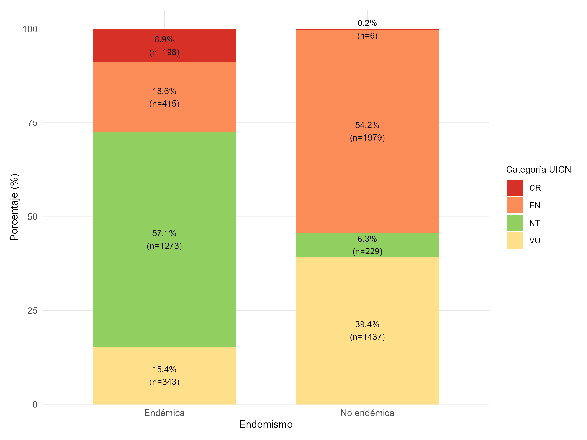
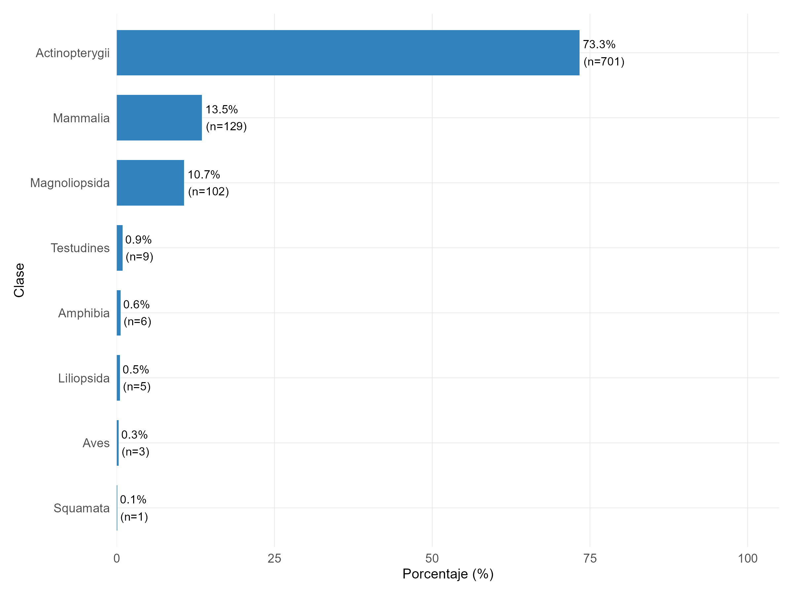
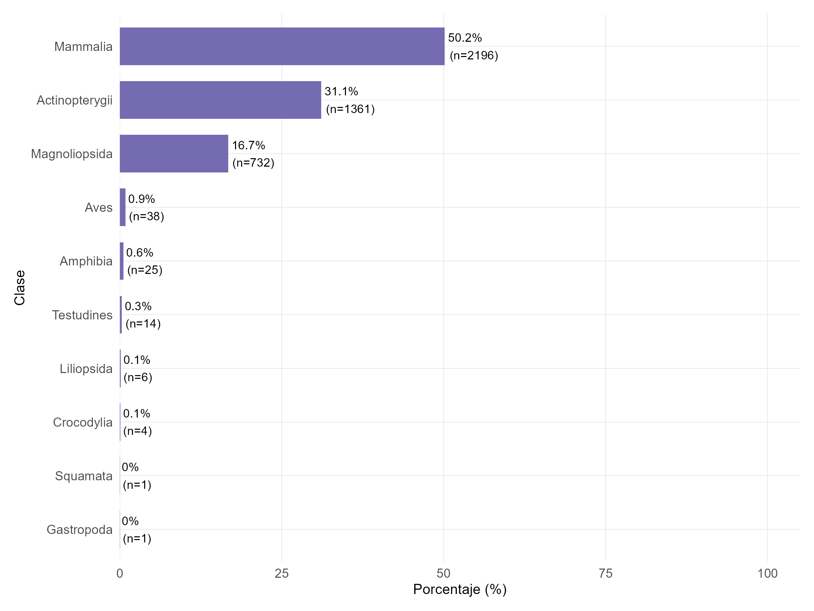
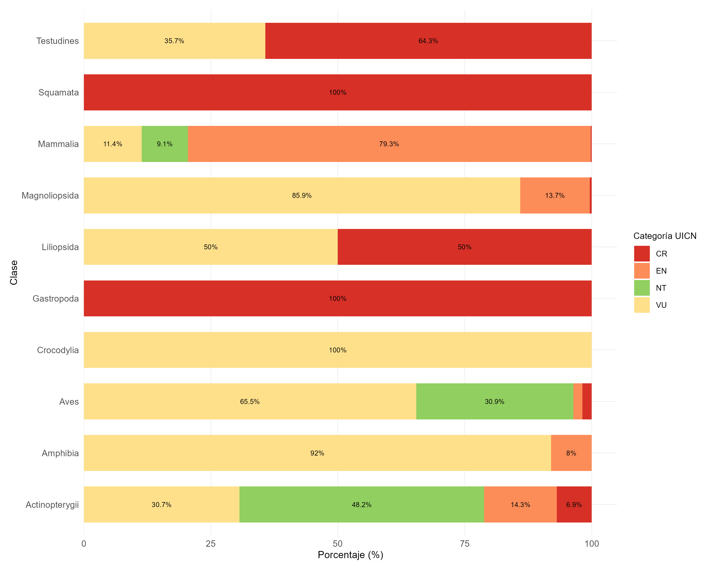
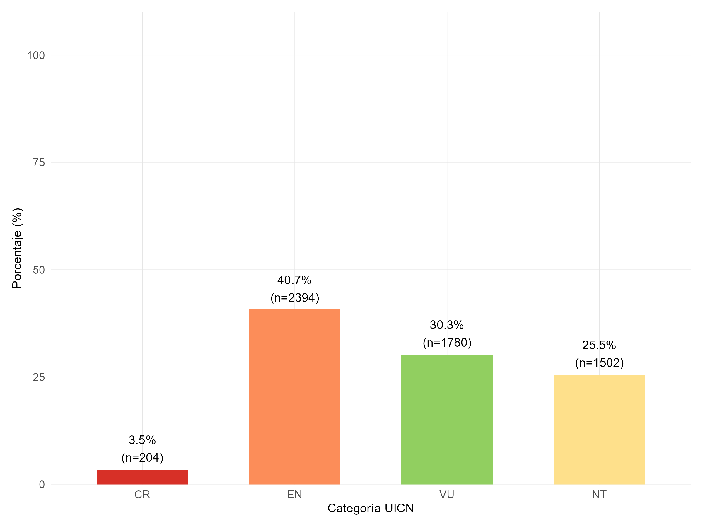
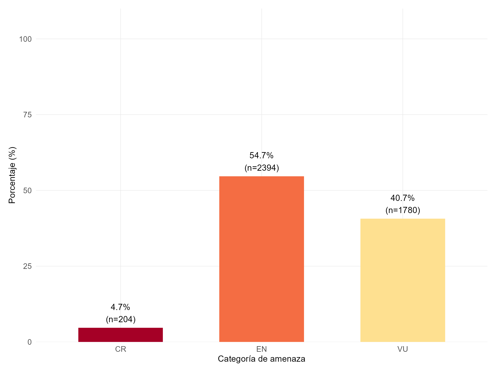
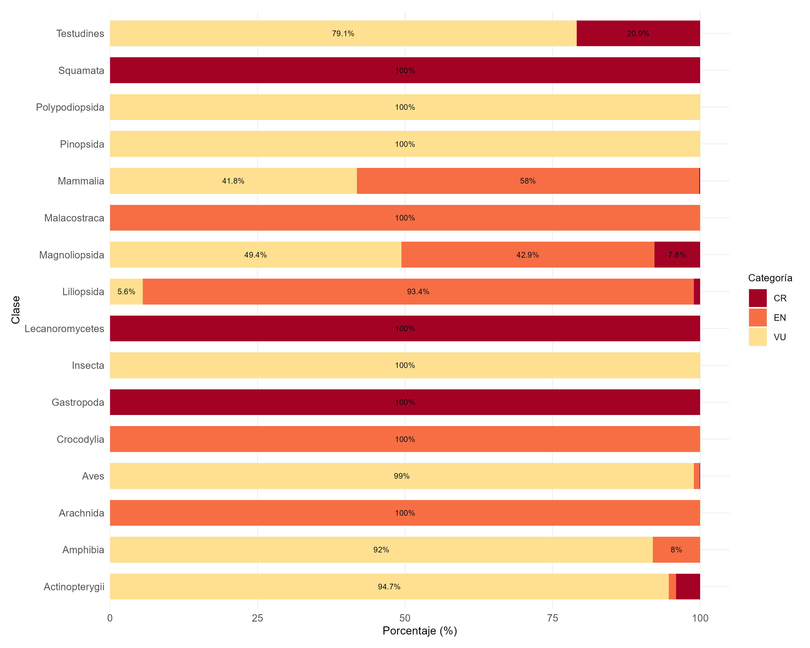

# Especies que se encuentran amenazadas segun IUCN

De las 5880 especies observadas en la zona  de Magdalena Medio, 2,229 corresponden endémicas mientras 3651 son no endemicas, estas ultimas concentran su riqueza de especies amenazadas en las categorias vulnerable y en peligro alcanzando un 93.6%, mientras que las especies endemicas se conecntran principalmente en la categoria de amenza critica

# Especies amenazadas segun resolucion 126 de 2024

