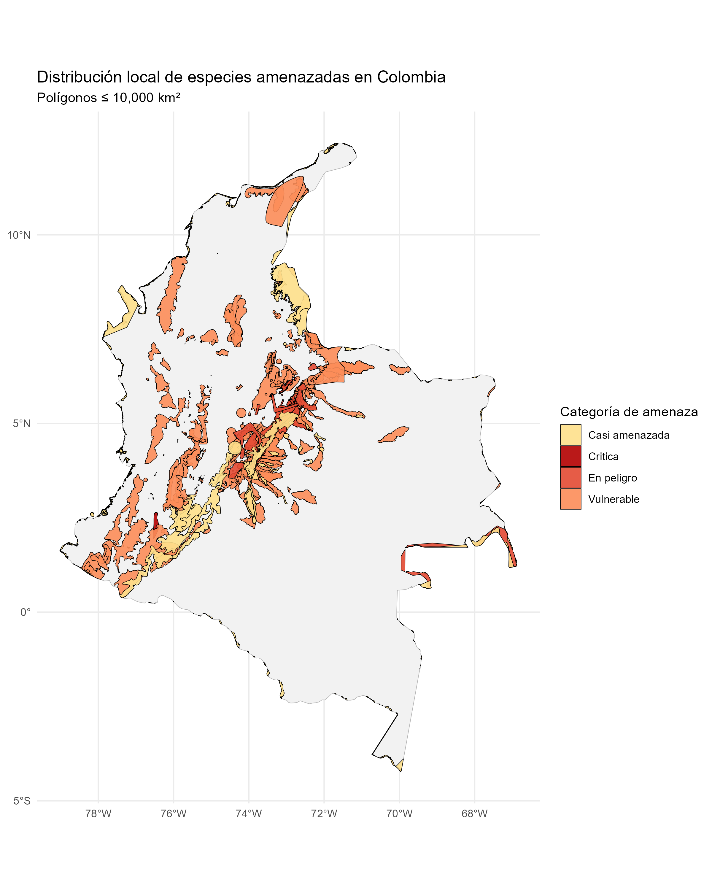
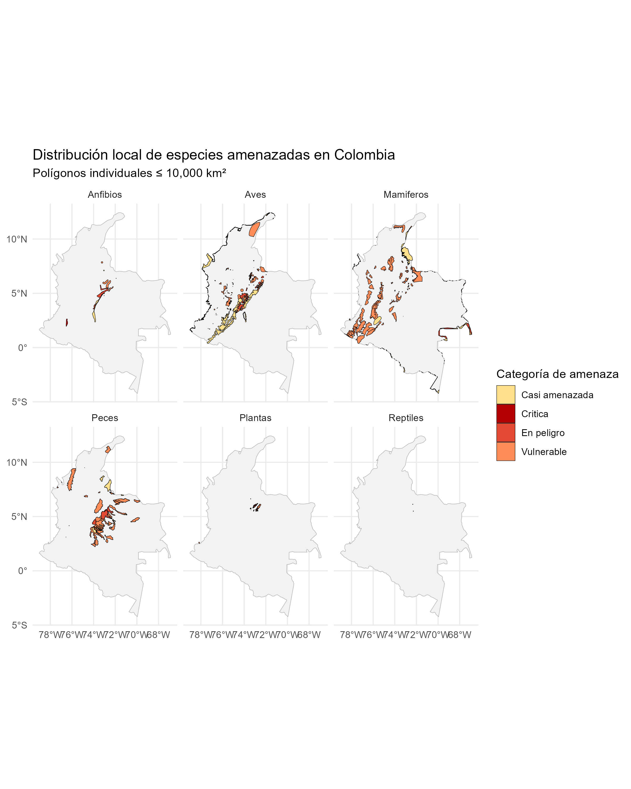
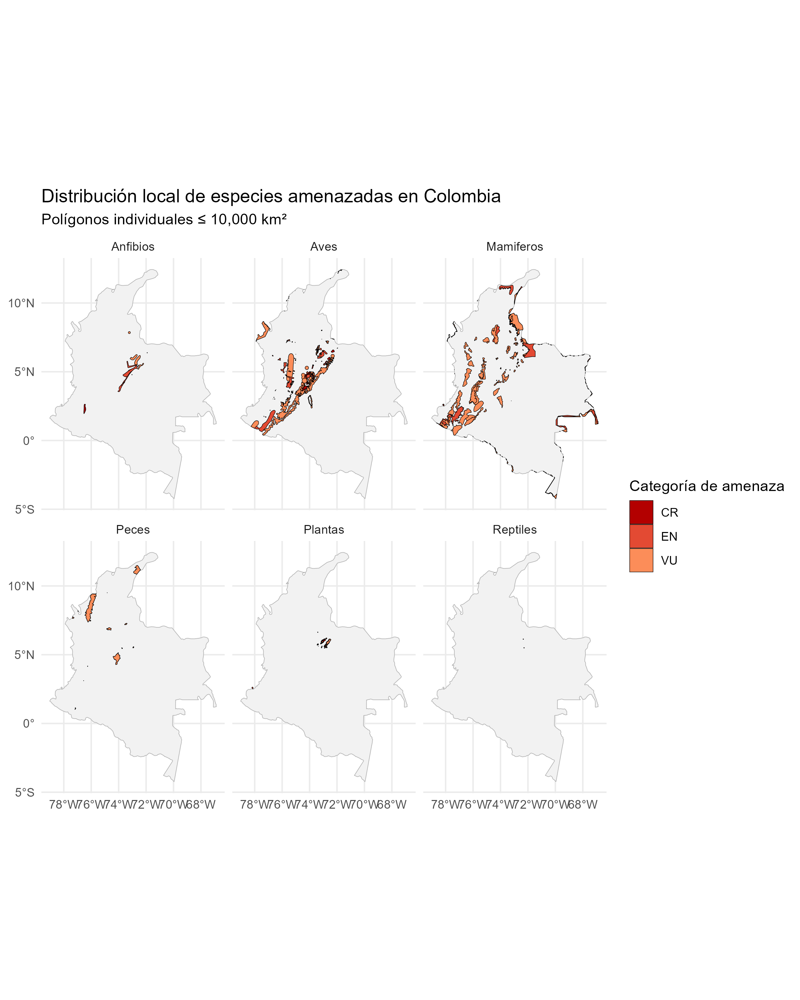

##🦎 Poligonos de especies amenazadas segun categoria UICN

## Poligonos de especies amenazadas por grupo

## 🦜 Poligonos de especies amenazdas segun categoria de resolucion 126 de 2024

## Poligonos de especies amenazadas por grupo segun categoria de resolucion 126 de 2024

## Amenazas segun la uicn para la especies presentes en la zona

## 🦦 Amenazas UICN para las especies presentes en el poligono

Un total de 42 especies para la zona del altiplano de Casanare presentan una amenaza en común de nivel uno que se relaciona con aspectos de desarrollo residencial y comercial, dentro de los cuales destaca el establecimiento de diferente infraestructura para la formación de asentamientos humanos, dentro de las cuales cinco especies (Chaetostoma dorsale, Chaetostoma formosae, Dolichancistrus fuesslii, Lontra longicaudis, Pentagonia magnifica), tiene una alcance major de este tipo de presión, lo que afectan notoriamente su categorización dentro de la lista roja; igualmente para el segundo nivel que corresponde a afectaciones en las especies generadas por actividades como agricultura y acuicultura específicamente actividades con cultivos anuales y perennes que tienen un impacto mayor en grupos de mamíferos como (Lontra longicaudis, Tremarctos ornatus, Myrmecophaga tridactyla).

El nivel tres de amenazas que corresponde a impactos relacionados con la minería y la producción de energía, dentro de estos destacan para la zona de interés las actividades petroleras, siendo la especie que presentan mayor afectación Tremarctos ornatus y en menor medida Panthera onca, Symplocos trianae, Farlowella acus, Creagrutus atratus, Farlowella colombiensis, Chaetostoma joropo, Bromelia trianae, Knodus meridae, mientras para el nivel cuatro relacionado con transporte y corredores de servicios, la infraestructura vial genera un impacto sobre todas las poblaciones de Ayenia stipularis.

  <a href="tabla_iucn.html" 
     style="background:#2c7a7b; color:white; padding:10px 18px; 
            text-decoration:none; border-radius:6px;">
     🔎 Consultar base de datos completa
  </a>

